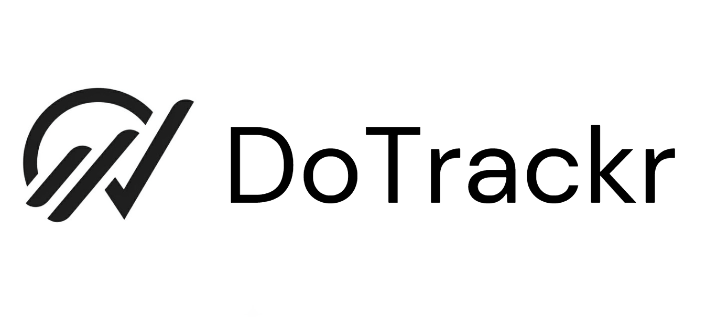

<p align="center">
  
</p>

<h1 align="center">DoTrackr</h1>

<p align="center">
  <strong>A premium habit & todo tracker with smart push notifications — built entirely in Flutter.</strong>
</p>

<p align="center">
  
  
  
  
</p>

---

## What is DoTrackr?

DoTrackr is a full-featured productivity app for Android that helps you:
- **Track daily habits** with streaks, completion rates, and heatmaps
- **Manage todos** with priorities, due dates, and categories
- **Set smart reminders** with push notifications and an automatic 11 PM daily summary for pending tasks
- **Visualize your progress** with a stunning statistics dashboard
- **Back up and restore** your data locally so you never lose your history

---

## ✨ Features

| Feature | Details |
|---|---|
| **Habits** | Daily / weekly / custom frequency, multi-reminder support |
| **Todos** | Due dates, priority levels, categories, reminders |
| **Smart Notifications** | Standard battery-friendly push notifications and a daily 11 PM summary for incomplete tasks |
| **Statistics** | W/M/Y timeline, consistency heatmap (month-by-month), habit breakdown, trophy room |
| **Data Backup** | Export to Downloads as JSON; re-import on any device after reinstall |
| **Premium UI** | Dark mode, glassmorphism, micro-animations, Google Fonts Inter |

---

##  Architecture & Tech Stack

DoTrackr is built with clean, pragmatic architecture — no over-engineering:

```
lib/
├── core/              # App-wide constants, theme, utilities
├── data/
│   ├── models/        # Hive-annotated data models (TodoModel, HabitModel, etc.)
│   └── services/      # DatabaseService (Hive), NotificationService (flutter_local_notifications)
└── presentation/
    ├── providers/      # Riverpod StateNotifiers — single source of truth
    ├── screens/        # One folder per screen (todos, habits, stats, settings…)
    └── widgets/        # Shared reusable UI widgets
```

### Why these libraries?

| Library | What it does | Why |
|---|---|---|
| **Hive** | Local NoSQL database | Fast, no native dependencies, works offline |
| **Riverpod** | State management | Compile-safe, testable, replaces Provider |
| **flutter_local_notifications** | Scheduled & immediate notifications | Standard inexact push notifications without background wakelocks |
| **fl_chart** | Bar charts for statistics | Customizable, animated |
| **screenshot** | Capture widgets as PNG | Powers the share feature |
| **file_picker** | Pick JSON backup files | Import data after reinstall |
| **Google Fonts** | Inter typeface | Consistent premium typography |
| **Riverpod** | State | Clean reactive state across screens |

---

## Getting Started

### Prerequisites
- Flutter 3.x SDK ([install](https://docs.flutter.dev/get-started/install))
- Android device / emulator (API 23+)

### Run from source
```bash
git clone https://github.com/yourusername/DoTrackr.git
cd DoTrackr/dotrackr
flutter pub get
flutter run
```

### Build release APK
```bash
flutter build apk --release
# APK at: build/app/outputs/flutter-apk/app-release.apk
```

---

## 📦 Download

Pre-built APK is available in the root of this repo: [`DoTrackr.apk`](./DoTrackr.apk)

> Enable "Install from unknown sources" in your Android settings before installing.

---

## Screenshots

> _(Add screenshots here)_

---

## Data Backup

Your data is stored locally on your device. To safeguard against reinstallation:

1. Go to **Settings → Export Data** → saves `dotrackr_backup_<timestamp>.json` to your Downloads folder
2. After reinstalling, go to **Settings → Import Data** → pick your backup file
3. All your todos, habits, habit logs, and categories are restored instantly

---

## Contributing

Pull requests are welcome! Please open an issue first to discuss major changes.

---

## License

This project is licensed under the **MIT License** — see [LICENSE](./LICENSE) for details.

---

## Author

**Bhupesh** — [@bhupesh](https://linkedin.com/in/bhupesh)

> Built with ❤️ using Flutter
